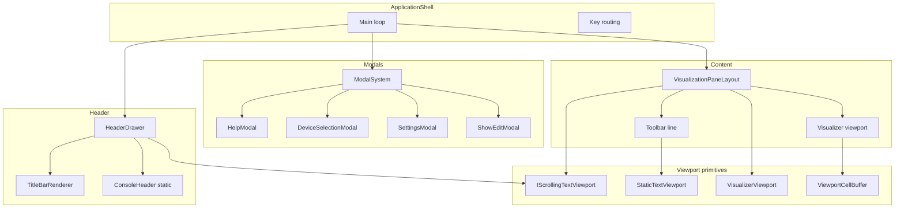

# List of UI Components in AudioAnalyzer

The UI is a console-based presentation layer in the **Console** project, with shared viewport/text utilities in **Application**. Components follow the renderer + `IKeyHandler<TContext>` pattern where they need both drawing and key handling (ADR-0042).

---

## 1. Orchestration / Shell

| Component | Role |
|-----------|------|
| **ApplicationShell** | Main loop, key routing (main + modals), device lifecycle, preset/palette actions. Holds `IHeaderDrawer`, `IVisualizationRenderer`, modals, and key handlers. |
| **ModalSystem** | Runs modals: `RunModal` (full-screen) and `RunOverlayModal` (top rows only). Used by Help, DeviceSelection, Settings, and ShowEdit modals. ([ModalSystem.cs](../src/AudioAnalyzer.Console/Console/ModalSystem.cs)) |

---

## 2. Header

| Component | Interface | Role |
|-----------|------------|------|
| **ConsoleHeader** | (static helper) | Draws header lines (title box, device, now-playing, BPM, volume, shortcuts). No DI; used by HeaderDrawer. ([ConsoleHeader.cs](../src/AudioAnalyzer.Console/Console/ConsoleHeader.cs)) |
| **HeaderDrawer** | IHeaderDrawer | Injectable. Draws full header or header-only; wires title bar, device/now-playing viewports, engine state, and UiSettings into ConsoleHeader. ([HeaderDrawer.cs](../src/AudioAnalyzer.Console/Console/HeaderDrawer.cs)) |
| **TitleBarRenderer** | ITitleBarRenderer | Injectable. Renders the title bar breadcrumb `{appName}/{mode}/{preset}[z]: {layer}` (e.g. cyberpunk style). ([TitleBarRenderer.cs](../src/AudioAnalyzer.Console/Console/TitleBarRenderer.cs)) |

---

## 3. Modals (injectable; ADR-0035)

| Component | Interface | Role |
|-----------|------------|------|
| **HelpModal** | IHelpModal | Full-screen modal (RunModal). Shows help text; any key closes. ([HelpModal.cs](../src/AudioAnalyzer.Console/Console/HelpModal.cs)) |
| **DeviceSelectionModal** | IDeviceSelectionModal | Full-screen modal. Device list and selection. ([DeviceSelectionModal.cs](../src/AudioAnalyzer.Console/Console/DeviceSelectionModal.cs)) |
| **SettingsModal** | ISettingsModal | Overlay modal. Layer/preset/settings editing; uses ISettingsModalRenderer + IKeyHandler&lt;SettingsModalKeyContext&gt;. ([SettingsModal.cs](../src/AudioAnalyzer.Console/Console/SettingsModal.cs), [SettingsModalRenderer.cs](../src/AudioAnalyzer.Console/SettingsModal/SettingsModalRenderer.cs)) |
| **ShowEditModal** | IShowEditModal | Overlay modal. Edit show (preset list + durations). ([ShowEditModal.cs](../src/AudioAnalyzer.Console/Console/ShowEditModal.cs)) |

---

## 4. Main content (visualization area)

| Component | Interface | Role |
|-----------|------------|------|
| **VisualizationPaneLayout** | IVisualizationRenderer | Renders the main content: one toolbar line (preset/layer info via scrolling viewport) and the visualizer viewport below. Creates `VisualizerViewport` for toolbar and for the visualizer. ([VisualizationPaneLayout.cs](../src/AudioAnalyzer.Console/Console/VisualizationPaneLayout.cs)) |

---

## 5. Viewport / text building blocks (Application)

These are shared primitives used by header, modals, and visualization pane (ADR-0020, ADR-0037, ADR-0039):

| Component | Role |
|-----------|------|
| **IScrollingTextViewport** / **ScrollingTextViewport** | Ping-pong scrolling text; used for device name, now-playing, toolbar label. Created via factory. |
| **IScrollingTextViewportFactory** | Creates scrolling viewports (e.g. one per header row, one for toolbar). |
| **StaticTextViewport** | Static truncation: `TruncateToWidth`, `TruncateWithEllipsis` (for titles, labels, fixed-width lines). ([StaticTextViewport.cs](../src/AudioAnalyzer.Application/Display/StaticTextViewport.cs)) |
| **VisualizerViewport** | Struct (StartRow, MaxLines, Width) defining the rectangle for visualizer output. ([VisualizerViewport.cs](../src/AudioAnalyzer.Application/Abstractions/VisualizerViewport.cs)) |
| **ViewportCellBuffer** | Cell buffer used by TextLayers visualizer to compose then flush to console. ([ViewportCellBuffer.cs](../src/AudioAnalyzer.Application/Viewports/ViewportCellBuffer.cs)) |

---

## 6. Console output

| Component | Interface | Role |
|-----------|------------|------|
| **ConsoleWriter** | IConsoleWriter | Flushes `ViewportCellBuffer` (and other console writes) to the terminal. Console project owns all console I/O. |

---

## 7. Key handlers (paired with UI components)

Key handling is separate from rendering (ADR-0042); each component that needs input uses `IKeyHandler<TContext>`:

- **Main loop**: `IKeyHandler<MainLoopKeyContext>` (e.g. opens modals, toggles full screen).
- **Settings modal**: `IKeyHandler<SettingsModalKeyContext>` (navigation, edit, close).
- **TextLayers visualizer**: `IKeyHandler<TextLayersKeyContext>` (layer/preset keys).

---

## Summary diagram

---

## Where components live

- **Console project**: [ApplicationShell.cs](../src/AudioAnalyzer.Console/ApplicationShell.cs), [Console/](../src/AudioAnalyzer.Console/Console/) (ConsoleHeader, ModalSystem, HeaderDrawer, TitleBarRenderer, HelpModal, DeviceSelectionModal, SettingsModal, ShowEditModal, VisualizationPaneLayout), [SettingsModal/](../src/AudioAnalyzer.Console/SettingsModal/), [Abstractions/](../src/AudioAnalyzer.Console/Abstractions/) (IHeaderDrawer, ITitleBarRenderer, I*Modal, ISettingsModalRenderer).
- **Application project**: [Abstractions/](../src/AudioAnalyzer.Application/Abstractions/) (interfaces and DTOs), [Display/](../src/AudioAnalyzer.Application/Display/) (StaticTextViewport, PlainText, AnsiText, AnsiConsole, DisplayWidth, TextHelpers), [Viewports/](../src/AudioAnalyzer.Application/Viewports/) (ViewportCellBuffer), [ScrollingTextViewport.cs](../src/AudioAnalyzer.Application/ScrollingTextViewport.cs), [ScrollingTextViewportFactory.cs](../src/AudioAnalyzer.Application/ScrollingTextViewportFactory.cs).

All of the above are the distinct UI components; visualizers (e.g. TextLayersVisualizer, IVisualizer implementations) are content that render *into* the visualization area rather than separate top-level UI components.
