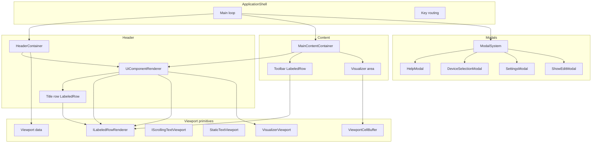

# List of UI Components in AudioAnalyzer

The UI is a console-based presentation layer in the **Console** project, with shared viewport/text utilities in **Application**. UI is composed from **IUiComponent** trees (composites and leaves) and **IUiComponentRenderer** (dispatches by component type to concrete renderers); see [ADR-0052](adr/0052-ui-container-component-renderer.md). Component instances own their state; **IUiStateUpdater&lt;TComponent&gt;** updates state before render (ADR-0054). All single-line rows (title bar, header rows, toolbar) are **LabeledRowComponent** instances; the only other leaf type is **VisualizerAreaComponent**. Rows use **Viewport** data and **ILabeledRowRenderer** (ADR-0051). Single-cell scrolling (e.g. TextLayers toolbar) still uses **IScrollingTextViewport** from the factory. Components follow the renderer + `IKeyHandler<TContext>` pattern where they need both drawing and key handling (ADR-0042). Layout follows [ADR-0050](adr/0050-ui-alignment-blocks-label-format.md): left alignment, 8-character block sizing (default 8 cols label + 8 cols value for label components), and labels as `Label:value` (colon, no space before value).

---

## 1. Orchestration / Shell

| Component | Role |
|-----------|------|
| **ApplicationShell** | Main loop, key routing (main + modals), device lifecycle, preset/palette actions. Holds `IHeaderContainer`, `IVisualizationRenderer`, modals, and key handlers. |
| **ModalSystem** | Runs modals: `RunModal` (full-screen) and `RunOverlayModal` (top rows only). Used by Help, DeviceSelection, Settings, and ShowEdit modals. ([ModalSystem.cs](../src/AudioAnalyzer.Console/Console/ModalSystem.cs)) |

---

## 2. Header

| Component | Interface | Role |
|-----------|------------|------|
| **HeaderContainer** | IHeaderContainer | UI container for the header. DrawMain (clear + draw) and DrawHeaderOnly (refresh lines). State updated by **HeaderContainerStateUpdater** before render; returns three stable **LabeledRowComponent** instances (title row, Device/Now, BPM/Volume). Renders via IUiComponentRenderer. ([HeaderContainer.cs](../src/AudioAnalyzer.Console/Console/HeaderContainer.cs)) |
| **UiComponentRenderer** | IUiComponentRenderer | Dispatches by component type to LabeledRowComponent renderer and VisualizerAreaComponent renderer. Recurses on composites. Callers run **IUiStateUpdater&lt;IUiComponent&gt;.Update** before Render. ([UiComponentRenderer.cs](../src/AudioAnalyzer.Console/Console/UiComponentRenderer.cs)) |
| **ITitleBarContentProvider** / **TitleBarContentProvider** | ITitleBarContentProvider | Supplies title bar content (breadcrumb `{appName}/{mode}/{preset}[z]: {layer}` in cyberpunk style) as IDisplayText. HeaderContainer builds the title row viewport from this. ([ITitleBarContentProvider.cs](../src/AudioAnalyzer.Console/Abstractions/ITitleBarContentProvider.cs), [TitleBarContentProvider.cs](../src/AudioAnalyzer.Console/Console/TitleBarContentProvider.cs)) |
| **ConsoleDimensions** | (static helper) | GetConsoleWidth() for modals and other code that does not have IDisplayDimensions injected. ([ConsoleDimensions.cs](../src/AudioAnalyzer.Console/Console/ConsoleDimensions.cs)) |

---

## 3. Modals (injectable; ADR-0035)

| Component | Interface | Role |
|-----------|------------|------|
| **HelpModal** | IHelpModal | Full-screen modal (RunModal). Shows help text; any key closes. ([HelpModal.cs](../src/AudioAnalyzer.Console/Console/HelpModal.cs)) |
| **DeviceSelectionModal** | IDeviceSelectionModal | Full-screen modal. Device list and selection. ([DeviceSelectionModal.cs](../src/AudioAnalyzer.Console/Console/DeviceSelectionModal.cs)) |
| **SettingsModal** | ISettingsModal | Overlay modal. Layer/preset/settings editing; uses ISettingsModalRenderer + IKeyHandler&lt;SettingsModalKeyContext&gt;. ([SettingsModal.cs](../src/AudioAnalyzer.Console/Console/SettingsModal.cs), [SettingsModalRenderer.cs](../src/AudioAnalyzer.Console/SettingsModal/SettingsModalRenderer.cs)) |
| **ShowEditModal** | IShowEditModal | Overlay modal. Edit show (preset list + durations). ([ShowEditModal.cs](../src/AudioAnalyzer.Console/Console/ShowEditModal.cs)) |

---

## 4. Main content (visualization area)

| Component | Interface | Role |
|-----------|------------|------|
| **MainContentContainer** | IVisualizationRenderer | UI container for main content. Returns **LabeledRowComponent** (toolbar: suffix + palette cell) and **VisualizerAreaComponent** (or only VisualizerArea in fullscreen). Renders via IUiComponentRenderer. Implements SetPalette, SupportsPaletteCycling, HandleKey by delegating to the visualizer. ([MainContentContainer.cs](../src/AudioAnalyzer.Console/Console/MainContentContainer.cs)) |

---

## 5. Viewport / text building blocks (Application)

These are shared primitives used by header, modals, and visualization pane (ADR-0020, ADR-0037, ADR-0039):

| Component | Role |
|-----------|------|
| **IUiComponent** | Node in the UI tree. Leaf types: **LabeledRowComponent** (all single-line rows: title, header, toolbar), **VisualizerAreaComponent** (block). Composites use **CompositeComponent**. ([IUiComponent.cs](../src/AudioAnalyzer.Application/Abstractions/IUiComponent.cs)) |
| **RenderContext** | Passed from container to renderer: Width, StartRow, MaxLines, Palette, ScrollSpeed, optional DeviceName/Snapshot/PaletteDisplayName, InvalidateWriteCache. ([RenderContext.cs](../src/AudioAnalyzer.Application/Abstractions/RenderContext.cs)) |
| **IUiStateUpdater&lt;TComponent&gt;** | Updates component state from context before render. Dispatcher **IUiStateUpdater&lt;IUiComponent&gt;** (UiComponentStateUpdater) recurses on composites and delegates to concrete updaters (e.g. HeaderContainerStateUpdater). ([ADR-0054](adr/0054-ui-component-state-ownership.md), [IUiStateUpdater.cs](../src/AudioAnalyzer.Application/Abstractions/IUiStateUpdater.cs)) |
| **Viewport** (data) | Data-only: label, optional hotkey, value getter `Func<IDisplayText>`, optional colors, optional **PreformattedAnsi** (render as-is with truncate-with-ellipsis). Layouts compose rows by creating viewports. No scroll state. ([Viewport.cs](../src/AudioAnalyzer.Application/Abstractions/Viewport.cs)) |
| **ILabeledRowRenderer** / **LabeledRowRenderer** | Renders one row of viewports into one line. When rendering through the component tree, **LabeledRowComponent** owns per-slot scroll state (GetSlotState); when using RenderRow directly (e.g. modals), the renderer uses its own slot state with `startSlotIndex`. Used for title bar, header rows 2–3, toolbar, and settings hint line. ([ADR-0054](adr/0054-ui-component-state-ownership.md), [LabeledRowRenderer.cs](../src/AudioAnalyzer.Application/LabeledRowRenderer.cs)) |
| **IScrollingTextViewport** / **ScrollingTextViewport** | Stateful single-cell scrolling: `FormatLabel`, `Render`, `RenderWithLabel`. Used where one scroll region is needed (e.g. TextLayersToolbarBuilder). Created via factory. ([ADR-0051](adr/0051-viewport-as-data-layouts-compose.md)) |
| **IScrollingTextViewportFactory** | Creates scrolling viewports for single-cell use (e.g. toolbar builder). |
| **ITextLayersToolbarBuilder** / **TextLayersToolbarBuilder** | Builds the TextLayers toolbar row (layer digits 1–9, optional Gain, Palette). Lives in **Application** (interface and context in Abstractions; implementation in root). The visualizer supplies **TextLayersToolbarContext**; the builder produces the toolbar suffix string or viewport list. ([ITextLayersToolbarBuilder.cs](../src/AudioAnalyzer.Application/Abstractions/ITextLayersToolbarBuilder.cs), [TextLayersToolbarBuilder.cs](../src/AudioAnalyzer.Application/TextLayersToolbarBuilder.cs), [TextLayersToolbarContext.cs](../src/AudioAnalyzer.Application/Abstractions/TextLayersToolbarContext.cs)) |
| **StaticTextViewport** | Static truncation: `TruncateToWidth`, `TruncateWithEllipsis` (for titles, labels, fixed-width lines). ([StaticTextViewport.cs](../src/AudioAnalyzer.Application/Display/StaticTextViewport.cs)) |
| **VisualizerViewport** | Struct (StartRow, MaxLines, Width) defining the rectangle for visualizer output. ([VisualizerViewport.cs](../src/AudioAnalyzer.Application/Abstractions/VisualizerViewport.cs)) |
| **ViewportCellBuffer** | Cell buffer used by TextLayers visualizer to compose then flush to console. ([ViewportCellBuffer.cs](../src/AudioAnalyzer.Application/Viewports/ViewportCellBuffer.cs)) |

---

## 6. Console output

| Component | Interface | Role |
|-----------|------------|------|
| **ConsoleWriter** | IConsoleWriter | Flushes `ViewportCellBuffer` (and other console writes) to the terminal. Console project owns all console I/O. |

---

## 7. Key handlers (paired with UI components)

Key handling is separate from rendering (ADR-0042, ADR-0047); each component that needs input uses `IKeyHandler<TContext>`. Handlers are implemented via open generic registration: `IKeyHandler<>` → `GenericKeyHandler<>`, with per-context behaviour in `IKeyHandlerConfig<TContext>` implementations.

- **Main loop**: `IKeyHandler<MainLoopKeyContext>` (e.g. opens modals, toggles full screen).
- **Device selection modal**: `IKeyHandler<DeviceSelectionKeyContext>` (select device, confirm/cancel).
- **Settings modal**: `IKeyHandler<SettingsModalKeyContext>` (navigation, edit, close).
- **Show edit modal**: `IKeyHandler<ShowEditModalKeyContext>` (rename show, add/delete entries, duration).
- **TextLayers visualizer**: `IKeyHandler<TextLayersKeyContext>` (layer/preset keys).

---

## Summary diagram

```mermaid
flowchart TB
  subgraph shell [ApplicationShell]
    MainLoop[Main loop]
    KeyRouter[Key routing]
  end

  subgraph header [Header]
    HeaderContainer[HeaderContainer]
    ComponentRenderer[UiComponentRenderer]
    TitleRow[Title row LabeledRow]
  end

  subgraph modals [Modals]
    ModalSystem[ModalSystem]
    Help[HelpModal]
    Device[DeviceSelectionModal]
    Settings[SettingsModal]
    ShowEdit[ShowEditModal]
  end

  subgraph content [Content]
    MainContent[MainContentContainer]
    ToolbarRow[Toolbar LabeledRow]
    VisualizerArea[Visualizer area]
  end

  subgraph primitives [Viewport primitives]
    ViewportData[Viewport data]
    RowRenderer[ILabeledRowRenderer]
    ScrollingVP[IScrollingTextViewport]
    StaticVP[StaticTextViewport]
    VisualizerVP[VisualizerViewport]
    CellBuffer[ViewportCellBuffer]
  end

  MainLoop --> HeaderContainer
  MainLoop --> MainContent
  MainLoop --> ModalSystem
  HeaderContainer --> ComponentRenderer
  HeaderContainer --> ViewportData
  ComponentRenderer --> TitleRow
  ComponentRenderer --> RowRenderer
  ModalSystem --> Help
  ModalSystem --> Device
  ModalSystem --> Settings
  ModalSystem --> ShowEdit
  MainContent --> ComponentRenderer
  MainContent --> ToolbarRow
  MainContent --> VisualizerArea
  ComponentRenderer --> RowRenderer
  ComponentRenderer --> VisualizerVP
  TitleRow --> RowRenderer
  ToolbarRow --> RowRenderer
  VisualizerArea --> CellBuffer
```

---

## Where components live

- **Console project**: [ApplicationShell.cs](../src/AudioAnalyzer.Console/ApplicationShell.cs), [Console/](../src/AudioAnalyzer.Console/Console/) (HeaderContainer, MainContentContainer, UiComponentRenderer, TitleBarContentProvider, ConsoleDimensions, ModalSystem, HelpModal, DeviceSelectionModal, SettingsModal, ShowEditModal), [SettingsModal/](../src/AudioAnalyzer.Console/SettingsModal/), [Abstractions/](../src/AudioAnalyzer.Console/Abstractions/) (IHeaderContainer, ITitleBarContentProvider, I*Modal, ISettingsModalRenderer).
- **Application project**: [Abstractions/](../src/AudioAnalyzer.Application/Abstractions/) (interfaces and DTOs, including Viewport, ILabeledRowRenderer), [Display/](../src/AudioAnalyzer.Application/Display/) (StaticTextViewport, PlainText, AnsiText, AnsiConsole, DisplayWidth, TextHelpers), [Viewports/](../src/AudioAnalyzer.Application/Viewports/) (ViewportCellBuffer), [LabeledRowRenderer.cs](../src/AudioAnalyzer.Application/LabeledRowRenderer.cs), [ScrollingTextViewport.cs](../src/AudioAnalyzer.Application/ScrollingTextViewport.cs), [ScrollingTextViewportFactory.cs](../src/AudioAnalyzer.Application/ScrollingTextViewportFactory.cs).

All of the above are the distinct UI components; visualizers (e.g. TextLayersVisualizer, IVisualizer implementations) are content that render *into* the visualization area rather than separate top-level UI components.
