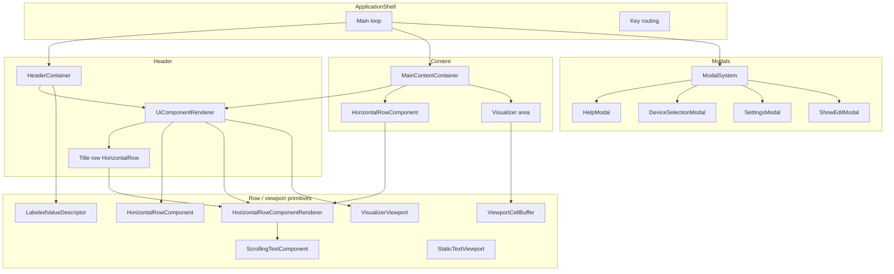

# List of UI Components in AudioAnalyzer

The UI is a console-based presentation layer in the **Console** project, with shared viewport/text utilities in **Application**. UI is composed from **IUiComponent** trees (composites and leaves) and **IUiComponentRenderer** (dispatches by component type to concrete renderers); see [ADR-0052](adr/0052-ui-container-component-renderer.md). Component instances own their state; **IUiStateUpdater&lt;TComponent&gt;** updates state before render (ADR-0054). Single-line rows: title bar, header rows, toolbar, and settings modal hint are **HorizontalRowComponent** with **ScrollingTextComponent** children (ADR-0056, [ADR-0057](adr/0057-horizontal-row-unified-single-line-rows.md)). Other leaf types: **VisualizerAreaComponent**. Rows use **LabeledValueDescriptor** data; **LabelFormatting** provides shared label formatting. **IScrollingTextViewport** remains for single-cell use outside the tree. Components follow the renderer + `IKeyHandler<TContext>` pattern where they need both drawing and key handling (ADR-0042). Layout follows [ADR-0050](adr/0050-ui-alignment-blocks-label-format.md): left alignment, 8-character block sizing (default 8 cols label + 8 cols value for label components), and labels as `Label:value` (colon, no space before value).

---

## 1. Orchestration / Shell

| Component | Role |
|-----------|------|
| **ApplicationShell** | Main loop, key routing (main + modals), device lifecycle, preset/palette actions. Holds `IHeaderContainer`, `IVisualizationRenderer`, modals, and key handlers. |
| **ModalSystem** | Runs modals: `RunModal` (full-screen) and `RunOverlayModal` (top rows only). **`onScrollTick`**: ~50 ms idle polling for lightweight updates (e.g. settings hint + Palette row or palette picker list via `DrawIdleOverlayTick`). Optional **`idleFullRedraw`**: full in-place redraw, throttled ~100 ms. Keys use full clear+draw. ([ModalSystem.cs](../src/AudioAnalyzer.Console/Console/ModalSystem.cs)) |

---

## 2. Header

| Component | Interface | Role |
|-----------|------------|------|
| **HeaderContainer** | IHeaderContainer | UI container for the header. DrawMain (clear + draw) and DrawHeaderOnly (refresh lines). State updated by **HeaderContainerStateUpdater** before render; **GetChildren** returns **one row** (title breadcrumb only) in General settings, **three rows** in Preset and Show modes (title, Device/Now, BPM/Volume). Renders via IUiComponentRenderer. ([HeaderContainer.cs](../src/AudioAnalyzer.Console/Console/HeaderContainer.cs), [ADR-0062](adr/0062-application-mode-classes.md)) |
| **UiComponentRenderer** | IUiComponentRenderer | Dispatches by component type to HorizontalRowComponent and VisualizerAreaComponent renderers. Recurses on composites. Callers run **IUiStateUpdater&lt;IUiComponent&gt;.Update** before Render. ([UiComponentRenderer.cs](../src/AudioAnalyzer.Console/Console/UiComponentRenderer.cs)) |
| **ITitleBarContentProvider** / **TitleBarContentProvider** | ITitleBarContentProvider | Delegates to **ITitleBarBreadcrumbFormatter** for one ANSI breadcrumb line. Same path rules on main header and modals (row 0); navigation via **ITitleBarNavigationContext** (ADR-0060). ([ITitleBarContentProvider.cs](../src/AudioAnalyzer.Console/Abstractions/ITitleBarContentProvider.cs), [TitleBarContentProvider.cs](../src/AudioAnalyzer.Console/Console/TitleBarContentProvider.cs), [TitleBarBreadcrumbFormatter.cs](../src/AudioAnalyzer.Application/Display/TitleBarBreadcrumbFormatter.cs)) |
| **ITitleBarBreadcrumbFormatter** / **TitleBarBreadcrumbFormatter** | ITitleBarBreadcrumbFormatter | Builds the universal title line (preset-scoped vs app-settings tracks). Registered in DI; modals call **TitleBarBreadcrumbRow.Write** after setting navigation context. |
| **ITitleBarNavigationContext** / **TitleBarNavigationContext** | ITitleBarNavigationContext | Active `TitleBarViewKind`, palette-picker flag, and focused-layer index/type for the S modal breadcrumb (`[n]:layerType` before `/palette`). |
| **ConsoleDimensions** | (static helper) | GetConsoleWidth() for modals and other code that does not have IDisplayDimensions injected. ([ConsoleDimensions.cs](../src/AudioAnalyzer.Console/Console/ConsoleDimensions.cs)) |

---

## 3. Modals (injectable; ADR-0035)

| Component | Interface | Role |
|-----------|------------|------|
| **HelpModal** | IHelpModal | Full-screen modal (RunModal). Shows help text; any key closes. ([HelpModal.cs](../src/AudioAnalyzer.Console/Console/HelpModal.cs)) |
| **DeviceSelectionModal** | IDeviceSelectionModal | Full-screen modal. Device list and selection; list drawing via **SettingsSurfacesListDrawing** shared with palette list patterns. UI spec: [ui-spec-device-selection-modal.md](ui-spec-device-selection-modal.md). ([DeviceSelectionModal.cs](../src/AudioAnalyzer.Console/Console/DeviceSelectionModal.cs)) |
| **SettingsModal** | ISettingsModal | Overlay modal. Layer/preset/settings editing; uses ISettingsModalRenderer + IKeyHandler&lt;SettingsModalKeyContext&gt;. Idle: **DrawIdleOverlayTick** (hint + Palette cell or scrollable palette picker when animation frame advances, batched sync output). Hint via **HorizontalRowComponent** (ADR-0057). Palette rows/picker via **SettingsSurfacesPaletteDrawing**. UI spec: [ui-spec-preset-settings-modal.md](ui-spec-preset-settings-modal.md). ([SettingsModal.cs](../src/AudioAnalyzer.Console/Console/SettingsModal.cs), [SettingsModalRenderer.cs](../src/AudioAnalyzer.Console/SettingsModal/SettingsModalRenderer.cs)) |
| **ShowEditModal** | IShowEditModal | Overlay modal. Edit show (preset list + durations). ([ShowEditModal.cs](../src/AudioAnalyzer.Console/Console/ShowEditModal.cs)) |

---

## 4. Main content (visualization area)

| Component | Interface | Role |
|-----------|------------|------|
| **MainContentContainer** | IVisualizationRenderer | UI container for main content. Returns **HorizontalRowComponent** (toolbar: cells from visualizer GetToolbarViewports/GetToolbarSuffix) and **VisualizerAreaComponent** (or only VisualizerArea in fullscreen). Renders via IUiComponentRenderer. Implements SetPalette, SupportsPaletteCycling, HandleKey by delegating to the visualizer. ([MainContentContainer.cs](../src/AudioAnalyzer.Console/Console/MainContentContainer.cs)) |

---

## 5. Viewport / text building blocks (Application)

These are shared primitives used by header, modals, and visualization pane (ADR-0020, ADR-0037, ADR-0039):

| Component | Role |
|-----------|------|
| **IUiComponent** | Node in the UI tree. Leaf types: **HorizontalRowComponent** (single-line rows: title, header, toolbar, modal hint), **ScrollingTextComponent** (single scrolling cell, used as child of HorizontalRowComponent), **VisualizerAreaComponent** (block). Composites use **CompositeComponent**. ([IUiComponent.cs](../src/AudioAnalyzer.Application/Abstractions/IUiComponent.cs)) |
| **RenderContext** | Passed from container to renderer: Width, StartRow, MaxLines, Palette, ScrollSpeed, optional DeviceName/Snapshot/PaletteDisplayName, InvalidateWriteCache. ([RenderContext.cs](../src/AudioAnalyzer.Application/Abstractions/RenderContext.cs)) |
| **IUiStateUpdater&lt;TComponent&gt;** | Updates component state from context before render. Dispatcher **IUiStateUpdater&lt;IUiComponent&gt;** (UiComponentStateUpdater) recurses on composites and delegates to concrete updaters (e.g. HeaderContainerStateUpdater). ([ADR-0054](adr/0054-ui-component-state-ownership.md), [IUiStateUpdater.cs](../src/AudioAnalyzer.Application/Abstractions/IUiStateUpdater.cs)) |
| **LabeledValueDescriptor** (data) | Data-only: label, optional hotkey, value getter `Func<IDisplayText>`, optional colors, optional **PreformattedAnsi** (render as-is with truncate-with-ellipsis). Layouts compose rows by creating descriptors. No scroll state. ([LabeledValueDescriptor.cs](../src/AudioAnalyzer.Application/Abstractions/LabeledValueDescriptor.cs)) |
| **ScrollingTextComponent** | Leaf IUiComponent for one scrolling text cell. Owns scroll state; cell data set via **SetFromDescriptor** each frame. Rendered by **ScrollingTextComponentRenderer**. Used as children of **HorizontalRowComponent** for the toolbar. ([ADR-0056](adr/0056-scrolling-text-as-uicomponent.md), [ScrollingTextComponent.cs](../src/AudioAnalyzer.Application/Abstractions/ScrollingTextComponent.cs)) |
| **HorizontalRowComponent** | Leaf that lays out **ScrollingTextComponent** children horizontally on one row. **SetRowData(descriptors, widths)** updates children each frame. Rendered by **HorizontalRowComponentRenderer**. ([HorizontalRowComponent.cs](../src/AudioAnalyzer.Application/Abstractions/HorizontalRowComponent.cs)) |
| **LabelFormatting** | Static helper **FormatLabel(label, hotkey)** for "Label:" or "Label(K):". Used by ScrollingTextComponentRenderer and TextLayersToolbarBuilder. ([LabelFormatting.cs](../src/AudioAnalyzer.Application/Display/LabelFormatting.cs)) |
| **IScrollingTextViewport** / **ScrollingTextViewport** | Stateful single-cell scrolling (FormatLabel, Render, RenderWithLabel). Still available via factory for use outside the component tree. ([ADR-0037](adr/0037-scrolling-text-viewport-injectable-service.md)) |
| **ITextLayersToolbarBuilder** / **TextLayersToolbarBuilder** | Builds the TextLayers toolbar row. **Preset editor**: layer digits 1–9, optional Gain, Palette (per-letter colors, phase from beat or tick). **Show play**: compact row (Show name, Entry index, Palette). ([ITextLayersToolbarBuilder.cs](../src/AudioAnalyzer.Application/Abstractions/ITextLayersToolbarBuilder.cs), [TextLayersToolbarBuilder.cs](../src/AudioAnalyzer.Application/TextLayersToolbarBuilder.cs), [ADR-0062](adr/0062-application-mode-classes.md)) |
| **PaletteSwatchFormatter** | Builds ANSI **per-grapheme** palette colors for palette names (toolbar, S modal Palette row, palette picker list); `ComputeToolbarPhaseOffset` uses beat count when BPM is active, else tick bucket. **SettingsModal** passes `IVisualizationOrchestrator.GetSnapshotForUi()` into the renderer so the modal matches the toolbar phase; idle `DrawIdleOverlayTick` redraws the Palette cell and the open picker when the animation frame advances. ([PaletteSwatchFormatter.cs](../src/AudioAnalyzer.Application/Display/PaletteSwatchFormatter.cs)) |
| **StaticTextViewport** | Static truncation: `TruncateToWidth`, `TruncateWithEllipsis` (for titles, labels, fixed-width lines). ([StaticTextViewport.cs](../src/AudioAnalyzer.Application/Display/StaticTextViewport.cs)) |
| **VisualizerViewport** | Struct (StartRow, MaxLines, Width) defining the rectangle for visualizer output. ([VisualizerViewport.cs](../src/AudioAnalyzer.Application/Abstractions/VisualizerViewport.cs)) |
| **ViewportCellBuffer** | Cell buffer used by TextLayers visualizer to compose then flush to console. ([ViewportCellBuffer.cs](../src/AudioAnalyzer.Application/Viewports/ViewportCellBuffer.cs)) |

---

## 6. Console output

| Component | Interface | Role |
|-----------|------------|------|
| **ConsoleWriter** | IConsoleWriter | Flushes `ViewportCellBuffer` (and other console writes) to the terminal. Console project owns all console I/O. |

---

## 7. Key handlers (paired with UI components)

Key handling is separate from rendering (ADR-0042, ADR-0047); each component that needs input uses `IKeyHandler<TContext>`. Handlers are implemented via open generic registration: `IKeyHandler<>` → `GenericKeyHandler<>`, with per-context behaviour in `IKeyHandlerConfig<TContext>` implementations.

- **Main loop**: `IKeyHandler<MainLoopKeyContext>` (e.g. opens modals, toggles full screen).
- **Device selection modal**: `IKeyHandler<DeviceSelectionKeyContext>` (select device, confirm/cancel).
- **Settings modal**: `IKeyHandler<SettingsModalKeyContext>` (navigation, edit, close).
- **Show edit modal**: `IKeyHandler<ShowEditModalKeyContext>` (rename show, add/delete entries, duration).
- **TextLayers visualizer**: `IKeyHandler<TextLayersKeyContext>` (layer/preset keys).

---

## Summary diagram

```mermaid
flowchart TB
  subgraph shell [ApplicationShell]
    MainLoop[Main loop]
    KeyRouter[Key routing]
  end

  subgraph header [Header]
    HeaderContainer[HeaderContainer]
    ComponentRenderer[UiComponentRenderer]
    TitleRow[Title row HorizontalRow]
  end

  subgraph modals [Modals]
    ModalSystem[ModalSystem]
    Help[HelpModal]
    Device[DeviceSelectionModal]
    Settings[SettingsModal]
    ShowEdit[ShowEditModal]
  end

  subgraph content [Content]
    MainContent[MainContentContainer]
    ToolbarRow[HorizontalRowComponent]
    VisualizerArea[Visualizer area]
  end

  subgraph primitives [Row / viewport primitives]
    ViewportData[LabeledValueDescriptor]
    HorizontalRow[HorizontalRowComponent]
    ScrollingTextComp[ScrollingTextComponent]
    HorizontalRowRenderer[HorizontalRowComponentRenderer]
    StaticVP[StaticTextViewport]
    VisualizerVP[VisualizerViewport]
    CellBuffer[ViewportCellBuffer]
  end

  MainLoop --> HeaderContainer
  MainLoop --> MainContent
  MainLoop --> ModalSystem
  HeaderContainer --> ComponentRenderer
  HeaderContainer --> ViewportData
  ComponentRenderer --> TitleRow
  ComponentRenderer --> HorizontalRow
  ModalSystem --> Help
  ModalSystem --> Device
  ModalSystem --> Settings
  ModalSystem --> ShowEdit
  MainContent --> ComponentRenderer
  MainContent --> ToolbarRow
  MainContent --> VisualizerArea
  ComponentRenderer --> HorizontalRowRenderer
  ComponentRenderer --> VisualizerVP
  TitleRow --> HorizontalRowRenderer
  ToolbarRow --> HorizontalRowRenderer
  HorizontalRowRenderer --> ScrollingTextComp
  VisualizerArea --> CellBuffer
```

---

## Where components live

- **Console project**: [ApplicationShell.cs](../src/AudioAnalyzer.Console/ApplicationShell.cs), [Console/](../src/AudioAnalyzer.Console/Console/) (HeaderContainer, MainContentContainer, UiComponentRenderer, TitleBarContentProvider, ConsoleDimensions, ModalSystem, HelpModal, DeviceSelectionModal, SettingsModal, ShowEditModal), [SettingsModal/](../src/AudioAnalyzer.Console/SettingsModal/), [Abstractions/](../src/AudioAnalyzer.Console/Abstractions/) (IHeaderContainer, ITitleBarContentProvider, I*Modal, ISettingsModalRenderer).
- **Application project**: [Abstractions/](../src/AudioAnalyzer.Application/Abstractions/) (interfaces and DTOs, including LabeledValueDescriptor, ScrollingTextComponent, HorizontalRowComponent), [Display/](../src/AudioAnalyzer.Application/Display/) (StaticTextViewport, LabelFormatting, PlainText, AnsiText, AnsiConsole, DisplayWidth), [Viewports/](../src/AudioAnalyzer.Application/Viewports/) (ViewportCellBuffer), [ScrollingTextComponentRenderer.cs](../src/AudioAnalyzer.Application/ScrollingTextComponentRenderer.cs), [ScrollingTextViewport.cs](../src/AudioAnalyzer.Application/ScrollingTextViewport.cs), [ScrollingTextViewportFactory.cs](../src/AudioAnalyzer.Application/ScrollingTextViewportFactory.cs).

All of the above are the distinct UI components; visualizers (e.g. TextLayersVisualizer, IVisualizer implementations) are content that render *into* the visualization area rather than separate top-level UI components.
