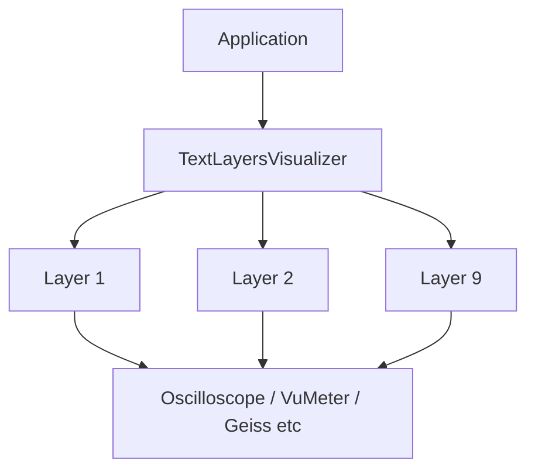

# Layered text (textlayers)

TextLayersVisualizer is the application's only visualizer (`IVisualizer`). All visual content — oscilloscope, VU meters, spectrum bars, plasma backgrounds, beat circles, etc. — is provided by `ITextLayerRenderer` layers. Users compose views by adding layers to presets; **V** cycles presets, **S** edits layer settings.

## Description

Composites multiple independent layers (e.g. ScrollingColors, Marquee, FallingLetters) with configurable text snippets and beat-reactive behavior. Uses a viewport-sized cell buffer for z-order compositing; layers are drawn in ascending ZOrder (lower = back).

## Snapshot usage

- `TextLayersConfig` — layer list and per-layer settings (set by renderer when mode is TextLayers)
- Each layer resolves its own palette from `PaletteId` (or inherits from `TextLayers.PaletteId`); no shared snapshot palette
- `BeatCount` — used for beat reactions
- `BeatFlashActive` — triggers SpeedBurst, Flash, SpawnMore, Pulse, ColorPop when true
- `SmoothedMagnitudes`, `TargetMaxMagnitude` — used by GeissBackground, BeatCircles, and UnknownPleasures for bass/treble intensity, plasma modulation, and pulse lines
- `Waveform`, `WaveformPosition`, `WaveformSize` — used by Oscilloscope layer for time-domain waveform
- NowPlaying layer injects INowPlayingProvider directly; see implementation notes below

## Presets

A **Preset** is a named TextLayers configuration (9 layers + PaletteId). Users can maintain multiple presets and switch with **V** (Preset editor mode). The active preset's config is the live editing buffer (`TextLayers`). Presets are stored as individual JSON files in the **`presets`** directory (like palettes). See [ADR-0019](../adr/0019-preset-textlayers-configuration.md) and [ADR-0022](../adr/0022-presets-in-own-files.md).

- **V** — Cycle to next preset (Preset editor only; toolbar shows "Preset: {name} (V)")
- **Tab** — Switch between Preset editor and Show play
- Settings modal title shows current preset; **R** to rename, **N** to create new preset (duplicate of current)

## Shows

A **Show** is an ordered collection of presets with per-entry duration. In **Show play** mode, presets auto-advance based on duration (Seconds or Beats). See [ADR-0031](../adr/0031-show-preset-collection.md).

- **Tab** — Switch to Show play (when Shows exist)
- **S** in Show play — Show edit modal (add/remove presets, set duration per entry)

## Settings

- **Schema**: Presets live in `presets/*.json`; `VisualizerSettings.ActivePresetId` references the active preset; `VisualizerSettings.Presets` and `TextLayers` are populated at runtime from preset files.
- **Preset file format**: `Name`, `Config` (TextLayersVisualizerSettings); id = filename without extension.
- **TextLayers.PaletteId** (string, optional): Default palette id for layers that do not have their own. Fallback when a layer's `PaletteId` is null/empty.
- **TextLayers.Layers** (array): Each layer has:
  - Common: `LayerType`, `Enabled`, `ZOrder`, `TextSnippets`, `BeatReaction`, `SpeedMultiplier`, `ColorIndex`, `PaletteId`
  - `Custom`: Layer-specific settings as a JSON object. Only the owning layer deserializes it. Per [ADR-0021](../adr/0021-textlayer-settings-common-custom.md):
    - AsciiImage: `ImageFolderPath`, `Movement` (None/Scroll/Zoom/Both), `PaletteSource` (LayerPalette/ImageColors), `ZoomMin`, `ZoomMax`, `ZoomSpeed`, `ZoomStyle` (Sine/Breathe/PingPong), `ScrollRatioY`
    - Oscilloscope: `Gain` (1.0–10.0)
    - LlamaStyle: `ShowVolumeBar`, `ShowRowLabels`, `ShowFrequencyLabels` (bool); `ColorScheme` ("Winamp"|"Spectrum"); `PeakMarkerStyle` ("Blocks"|"DoubleLine"); `BarWidth` (2|3)
    - NowPlaying: `VerticalPosition` ("Top"|"Center"|"Bottom")

## Key bindings

- **V** — Cycle to next preset (toolbar shows active preset name).
- **P** — Cycle the color palette of the **active layer** (the layer last selected with 1–9). Saved to that layer's settings.
- **S** — Open preset settings modal (title shows preset name; two-column: layer list on left, selected layer settings on right). The help line at the top auto-scrolls when it exceeds terminal width. Left panel: 1–9 select layer, ↑/↓ select, ←/→ change layer type, Enter move to settings panel, Space toggle enabled for selected layer, Shift+1–9 toggle enabled by slot, R rename preset, N new preset. Right panel: ↑/↓ select setting (list scrolls when there are more settings than fit on screen), Enter or +/- cycle settings with discrete values (enums, numbers, etc.), Enter to edit free-form strings (Snippets, Image path), Enter or ↑/↓ confirm string edits, ←/Esc back to layer list, ESC close. Cycle vs text-edit is derived from the setting type (EditMode). The S modal is the canonical UI for editing layer settings per [ADR-0023](../adr/0023-settings-modal-layer-editing.md).
- **1–9** — Select the corresponding layer as active (no type change). Key 1 = layer 1 (back), key 9 = layer 9 (front). Number keys and numpad keys work.
- **←/→** (Left/Right arrow) — Cycle layer type (includes None) when in layer list. Changes persist to the active preset file.
- **Shift+1–9** — Toggle the corresponding layer enabled/disabled. Disabled layers are not rendered. Changes persist to the active preset file.
- **I** — Cycle to the next picture in AsciiImage layers (only when at least one layer is AsciiImage).
- **[ / ]** — Adjust gain (1.0–10.0) when the selected layer is Oscilloscope.
- Toolbar suffix: shows layers as "123456789" (active in highlight, disabled dimmed); key hints (1–9 select, ←→ type, Shift+1–9 toggle); "Gain: X.X ([ ])" when Oscilloscope layer is selected; "Palette (LN): name (P)" for the active layer; "I: next image" when AsciiImage exists

## Viewport constraints

- Minimum width: 10
- Minimum height: 3 lines
- Uses full `viewport.Width` × `viewport.MaxLines` for cell buffer
- If no layers configured, renders empty gray buffer

## Implementation notes

- **Internal state**: `ViewportCellBuffer`; `_layerStates` (offset, snippet index per layer); `_fallingLettersByLayer` (particles for FallingLetters); `_asciiImageStateByLayer` (scroll, zoom, cache for AsciiImage); `_geissBackgroundStateByLayer` (phase, colorPhase, bass/treble for GeissBackground); `_beatCirclesStateByLayer` (circles, lastBeatCount for BeatCircles); `_paletteCycleLayerIndex` (layer whose palette P cycles); `_lastBeatCount`; `_beatFlashFrames`.
- **Cell buffer**: Per [ADR-0005](../adr/0005-layered-visualizer-cell-buffer.md); internal to this visualizer only.
- **None layer**: `LayerType.None` renders nothing; no renderer registered. Use ←/→ to cycle type (includes None). Use Shift+1–9 to toggle layer enabled/disabled.
- **Layer types**: Each type has its own class implementing `ITextLayerRenderer`, in a per-layer subfolder: `ScrollingColors/ScrollingColorsLayer`, `Marquee/MarqueeLayer`, etc. Layers are registered in the DI container via `AddTextLayerRenderers()` (ServiceCollectionExtensions); TextLayersVisualizer receives `IEnumerable<ITextLayerRenderer>` and builds a dictionary by LayerType. To add a new layer, register it in `AddTextLayerRenderers()`. Layers with custom settings have a *Settings.cs (e.g. `LlamaStyleSettings`, `OscilloscopeSettings`, `AsciiImageSettings`) and use `layer.GetCustom<TSettings>()` in Draw. Shared infrastructure (ITextLayerRenderer, TextLayerSettings, TextLayerDrawContext) stays in the TextLayers root.
- **Layer settings discovery**: Settings shown in the S modal are discovered via reflection per [ADR-0025](../adr/0025-reflection-based-layer-settings.md). Add `*Settings.cs` with properties; use `[SettingRange]`, `[SettingChoices]`, or `[Setting]` attributes where needed; register the type in `LayerSettingsReflection`. Cycle vs TextEdit mode is derived from property type and attributes.
- **GeissBackground layer**: Psychedelic plasma-style background; sine-based plasma with bass/treble modulation; uses SmoothedMagnitudes and TargetMaxMagnitude; Flash beat reaction boosts plasma intensity; palette or GetGeissColor fallback.
- **BeatCircles layer**: Expanding circles spawned on beat; draws only circle pixels (transparent elsewhere); uses BeatCount, SmoothedMagnitudes for maxRadius; up to 5 circles; aspect ratio 2.0 for elliptical appearance.
- **Oscilloscope layer**: Time-domain waveform; uses Waveform, WaveformPosition, WaveformSize; per-layer Gain (1.0–10.0); [ ] adjusts gain when layer is selected; per-layer palette (distance from center maps to palette index); `oscilloscope` palette provides classic gradient.
- **AsciiImage layer**: Reads images (BMP, GIF, JPEG, PNG, WebP) from `ImageFolderPath`, converts to ASCII via grayscale-to-character mapping; supports scroll, zoom, or both via `AsciiImageMovement`; configurable zoom range (ZoomMin/Max), speed, style (Sine/Breathe/PingPong) and scroll ratio (ScrollRatioY); color source: layer palette (brightness gradient) or per-pixel image colors (ImageColors); Flash beat reaction cycles to next image. Depends on SixLabors.ImageSharp.
- **UnknownPleasures layer**: Stacked waveform snapshots; bottom line realtime, others beat-triggered; uses SmoothedMagnitudes, NumBands, TargetMaxMagnitude, BeatCount; per-layer palette.
- **VuMeter layer**: Classic stereo VU meters; Left/Right channel levels, peak hold, dB scale, balance indicator; uses LeftChannel, RightChannel, LeftPeakHold, RightPeakHold.
- **LlamaStyle layer**: Spectrum bars (ex-Winamp/Spectrum Analyzer); configurable volume bar, row labels, frequency labels, color scheme (Winamp vs Spectrum), peak marker style, bar width; uses SmoothedMagnitudes, PeakHold, TargetMaxMagnitude, NumBands, Volume.
- **NowPlaying layer**: Displays currently playing media from system (e.g. Windows GSMTC). Injects INowPlayingProvider and calls GetNowPlayingText(); falls back to TextSnippets[0] when null, else "—". Centered when text fits width, marquee scroll when longer. VerticalPosition (Top/Center/Bottom) controls row. Supports BeatReaction, SpeedMultiplier, ColorIndex, PaletteId. See [ADR-0027](../adr/0027-now-playing-header.md), [ADR-0028](../adr/0028-layer-dependency-injection.md).
- **Beat reactions**: SpeedBurst (faster), Flash (advance/change), SpawnMore (spawn particles), Pulse (amplitude/color change), ColorPop (color offset).
- **References**: [ADR-0004](../adr/0004-visualizer-encapsulation.md), [ADR-0005](../adr/0005-layered-visualizer-cell-buffer.md), [ADR-0021](../adr/0021-textlayer-settings-common-custom.md), [ADR-0023](../adr/0023-settings-modal-layer-editing.md), [ADR-0025](../adr/0025-reflection-based-layer-settings.md).
