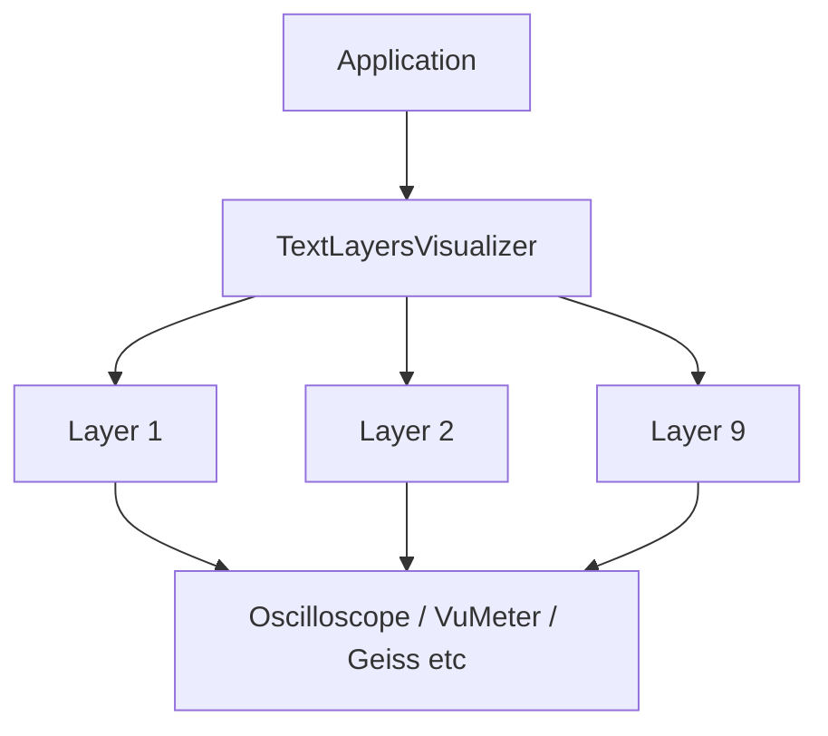

# Text layers visualizer (hub)

## Blueprint

### Context

All terminal visual content is composed through **TextLayersVisualizer** — the sole `IVisualizer` — and pluggable text layers (`TextLayerRendererBase`). Users build **presets** (layer stacks) and **shows** (timed preset sequences). This file is the **hub** spec: shared snapshot contracts, presets and shows, global key bindings, and pointers to per-layer specs under [`layers/`](./layers/).

### Architecture

- **Implementation root**: `src/AudioAnalyzer.Visualizers/TextLayers/`
- **Per-layer specs**: [`specs/text-layers-visualizer/layers/<slug>/spec.md`](./layers/)
- **ADRs**: Linked from the detailed reference section and from each layer spec.

### Constraints

- **Add layers, not visualizers**: extend `TextLayerRendererBase`; do not introduce another `IVisualizer` ([ADR-0014](../../docs/adr/0014-visualizers-as-layers.md)).
- **Viewport**: `.cursor/rules/visualizers-viewport.mdc`.
- **Layer settings**: reflection-based discovery ([ADR-0025](../../docs/adr/0025-reflection-based-layer-settings.md)).

## Contract

### Definition of Done

- `dotnet build .\AudioAnalyzer.sln` with **0 warnings** after changes to this domain.
- `dotnet test tests\AudioAnalyzer.Tests\AudioAnalyzer.Tests.csproj` passes (including visualizer tests where applicable).
- Behavior changes update this hub or the affected `layers/*/spec.md` in the **same commit**.

### Regression guardrails

- **Ctrl+R** clears runtime waveform/overview caches and layer state stores but **does not** rewrite preset JSON on disk.
- **V** / **Shift+V** / **S** / **Tab** semantics for presets, layers, and Show play stay aligned with [console-ui hub](../console-ui/spec.md) and [preset editor navigation](../console-ui/preset-editor-navigation/spec.md).

### Scenarios

```gherkin
Scenario: Preset cycle from toolbar
  Given the app is in Preset editor mode with multiple presets
  When the user presses V
  Then the next preset in alphabetical display-name order becomes active and the toolbar shows its name

Scenario: Preset cycle backward from toolbar
  Given the app is in Preset editor mode with multiple presets
  When the user presses Shift+V
  Then the previous preset in that display-name order becomes active and the toolbar shows its name

Scenario: Full layer reset
  Given Preset editor or Show play mode is active
  When the user presses Ctrl+R
  Then waveform and layer transient state are cleared without rewriting preset files on disk
```

## Layer index

| Kind | TechnicalName | Display name | Spec |
|------|---------------|--------------|------|
| Visualizer | textlayers | Layered text | _this hub_ |
| Layer | oscilloscope | Oscilloscope | [spec](./layers/oscilloscope/spec.md) |
| Layer | waveformstrip | Waveform strip | [spec](./layers/waveform-strip/spec.md) |
| Layer | vumeter | VU Meter | [spec](./layers/vu-meter-layer/spec.md) |
| Layer | llamastyle | Llama Style | [spec](./layers/llama-style/spec.md) |
| Layer (deprecated) | geiss | Geiss | [spec](./layers/geiss/spec.md) |
| Layer | unknownpleasures | Unknown Pleasures | [spec](./layers/unknown-pleasures/spec.md) |
| Layer | asciiimage | ASCII Image | [spec](./layers/ascii-image/spec.md) |
| Layer | asciivideo | ASCII Video | [spec](./layers/ascii-video/spec.md) |
| Layer | asciimodel | ASCII Model | [spec](./layers/ascii-model/spec.md) |
| Layer | mirror | Mirror | [spec](./layers/mirror/spec.md) |
| Layer | bufferdistortion | Buffer distortion | [spec](./layers/buffer-distortion/spec.md) |
| Layer | maschine | Maschine | [spec](./layers/maschine/spec.md) |
| Layer | fill | Fill | [spec](./layers/fill/spec.md) |
| Layer | fractalzoom | Fractal zoom | [spec](./layers/fractal-zoom/spec.md) |
| Layer | starfield | Starfield | [spec](./layers/starfield/spec.md) |
| Layer | mandalaringpulse | Mandala ring pulse | [spec](./layers/mandala-ring-pulse/spec.md) |
| Layer | hypnospiral | Hypno spiral | [spec](./layers/hypno-spiral/spec.md) |

## Implementation layout

All visual content lives in `src/AudioAnalyzer.Visualizers/TextLayers/<LayerName>/`. See [ADR-0007](../../docs/adr/0007-visualizer-subfolder-structure.md) and [ADR-0010](../../docs/adr/0010-appsettings-visualizer-settings-separation.md).

## For agents

1. **Add layers, not standalone visualizers** - inherit `TextLayerRendererBase`; see [ADR-0014](../../docs/adr/0014-visualizers-as-layers.md).
2. **Read** this hub and the relevant `layers/<slug>/spec.md`.
3. **Viewport**: `.cursor/rules/visualizers-viewport.mdc`.
4. **ADRs**: [ADR-0004](../../docs/adr/0004-visualizer-encapsulation.md), [ADR-0005](../../docs/adr/0005-layered-visualizer-cell-buffer.md), [ADR-0008](../../docs/adr/0008-visualizer-settings-di.md).
5. **Update specs** in the same commit as code changes.

---

## Reference: Layered text (full detail)
TextLayersVisualizer is the application's only visualizer (`IVisualizer`). All visual content — oscilloscope, VU meters, spectrum bars, plasma backgrounds, beat circles, etc. — is provided by text layer renderers (classes inheriting `TextLayerRendererBase`). Users compose views by adding layers to presets; **V** cycles presets, **S** edits layer settings.




## Description

Composites multiple independent layers (e.g. ScrollingColors, Marquee, FallingLetters) with configurable per-layer settings (including phrase lists where the layer type uses them) and beat-reactive behavior. Uses a viewport-sized cell buffer for z-order compositing; layers are drawn in ascending ZOrder (lower = back).

## Snapshot usage

- `TextLayersConfig` — layer list and per-layer settings (set by renderer when mode is TextLayers)
- Each layer resolves its own palette from `PaletteId` (or inherits from `TextLayers.PaletteId`); no shared snapshot palette
- `BeatCount` — used for beat reactions
- `BeatFlashActive` — triggers SpeedBurst, Flash, SpawnMore, Pulse, ColorPop when true
- `SmoothedMagnitudes`, `TargetMaxMagnitude` — used by GeissBackground, BeatCircles, and UnknownPleasures for bass/treble intensity, plasma modulation, and pulse lines
- `Waveform`, `WaveformPosition`, `WaveformSize` — used by **Oscilloscope** (512-sample scope) and as **fallback** for **Waveform strip** when overview is empty
- `WaveformOverviewMin` / `WaveformOverviewMax` / `WaveformOverviewBandLow` / `WaveformOverviewBandMid` / `WaveformOverviewBandHigh`, `WaveformOverviewLength`, `WaveformOverviewSpanSeconds` — decimated long-history overview for **Waveform strip** ([ADR-0077](../../docs/adr/0077-waveform-overview-snapshot.md))
- `FrameDeltaSeconds` — wall time since the previous full main render; layers scale continuous motion with `DisplayAnimationTiming.ScaleForReference60` so speed stays consistent when FPS varies ([ADR-0072](../../docs/adr/0072-delta-time-display-animation.md))
- NowPlaying layer injects INowPlayingProvider directly; see implementation notes below
- AsciiVideo layer injects IAsciiVideoFrameSource; frames are not part of the analysis snapshot ([ADR-0074](../../docs/adr/0074-ascii-video-layer-and-frame-source.md))
- **BufferDistortion** reads the **cell buffer** (composite of lower-Z layers) via `ViewportCellBuffer.Get`; it does not add new geometry from the snapshot. `BeatCount` is used only when spawning ripples in drop mode. See [buffer-distortion.md](./layers/buffer-distortion/spec.md).

## Presets

A **Preset** is a named TextLayers configuration (9 layers + PaletteId). Users can maintain multiple presets and switch with **V** (Preset editor mode). The active preset's config is the live editing buffer (`TextLayers`). Presets are stored as individual JSON files in the `**presets`** directory (like palettes). See [ADR-0019](../../docs/adr/0019-preset-textlayers-configuration.md) and [ADR-0022](../../docs/adr/0022-presets-in-own-files.md).

- **V** — Cycle to next preset (Preset editor only; toolbar shows "Preset: {name} (V)")
- **Tab** — Switch between Preset editor and Show play
- Settings modal title shows current preset; **R** to rename, **N** to create new preset (duplicate of current)

## Shows

A **Show** is an ordered collection of presets with per-entry duration. In **Show play** mode, presets auto-advance based on duration (Seconds or Beats). See [ADR-0031](../../docs/adr/0031-show-preset-collection.md).

- **Tab** — Switch to Show play (when Shows exist)
- **S** in Show play — Show edit modal (add/remove presets, set duration per entry)

## Settings

### Charsets vs TextSnippets ([ADR-0080](../../docs/adr/0080-shared-charset-json-and-layer-charset-ids.md))

- **Charsets** (`CharsetId` + `charsets/*.json`): use when the layer **selects one character at a time** for rendering (ASCII ramp, plasma/fractal density steps, Matrix-style glyph pool, Starfield star glyphs, etc.).
- **`Custom.TextSnippets`** (array of strings, only on layers that consume phrases): use when the layer needs a **whole phrase** (or multiple phrases)—Marquee, WaveText, StaticText, NowPlaying (fallback), Maschine, etc. Do not use snippets as a charset pool. **FallingLetters** uses **`CharsetId`** only for its glyph pool ([ADR-0081](../../docs/adr/0081-consolidate-matrix-rain-into-falling-letters.md)).

- **Schema**: Presets live in `presets/*.json`; `VisualizerSettings.ActivePresetId` references the active preset; `VisualizerSettings.Presets` and `TextLayers` are populated at runtime from preset files.
- **Preset file format**: `Name`, `Config` (TextLayersVisualizerSettings); id = filename without extension.
- **TextLayers.PaletteId** (string, optional): Default palette id for layers that do not have their own. Fallback when a layer's `PaletteId` is null/empty.
- **TextLayers.Layers** (array): Each layer has:
  - Common: `LayerType`, `Enabled`, `ZOrder`, `SpeedMultiplier`, `ColorIndex`, `PaletteId`
  - Optional `**RenderBounds`**: `{ "X", "Y", "Width", "Height" }` (0–1, relative to the visualizer viewport). **Omit or null** = full viewport. Outside the rectangle, lower layers show through. When set, each layer draws in **layer-local** cell coordinates matching that rectangle (centers, waveforms, and gradients use the clipped size, not the full terminal viewport). See [ADR-0058](../../docs/adr/0058-layer-render-bounds.md).
  - `Custom`: Layer-specific settings as a JSON object. Only the owning layer deserializes it. **Beat reaction** is layer-specific: only layers that support it have a `BeatReaction` property in Custom (with a layer-specific enum). Layers that do not use beat reaction (BeatCircles, Mirror, BufferDistortion, Fill, Oscilloscope, WaveformStrip, UnknownPleasures, VuMeter, LlamaStyle, Maschine) have no BeatReaction. See [ADR-0055](../../docs/adr/0055-layer-specific-beat-reaction.md). Per [ADR-0021](../../docs/adr/0021-textlayer-settings-common-custom.md):
    - AsciiImage: `BeatReaction` (None/SpeedBurst/Flash/Pulse), `ImageFolderPath`, `Movement` (None/Scroll/Zoom/Both), `PaletteSource` (LayerPalette/ImageColors), optional `CharsetId` (charset file id for luminance→glyph; unset → `ascii-ramp-classic`), `ZoomMin`, `ZoomMax`, `ZoomSpeed`, `ZoomStyle` (Sine/Breathe/PingPong), `ScrollRatioY`
    - AsciiVideo: `SourceKind` (Webcam/File — File not implemented), `WebcamDeviceIndex`, `MaxCaptureWidth`, `MaxCaptureHeight` (0 = no cap), `PaletteSource` (LayerPalette/ImageColors), optional `CharsetId` (unset → `ascii-ramp-classic`), `FlipHorizontal`
    - AsciiModel: `BeatReaction` (None/SpeedBurst/Flash), `ModelFolderPath`, `RotationAxis` (Y/Xyz), `RotationDirection` (Clockwise/CounterClockwise), `RotationSpeed`, `EnableZoom`, `ZoomMin`, `ZoomMax`, `ZoomSpeed`, `ZoomStyle` (Sine/Breathe/PingPong), optional `CharsetId` (legacy gradient ramp; unset → `ascii-ramp-classic`), `MaxTriangles`
    - Oscilloscope: `Gain` (1.0–10.0), `Filled` (bool)
    - WaveformStrip: `Gain` (1.0–10.0), `Filled` (bool), `ColorMode` (`PaletteDistance` | `SpectralApprox` | `SpectralGoertzel`), `StereoLayout` (`Mono` | `StereoStacked`), `FixedVisibleSeconds` (1–120), `BeatsPerBar` (1–16), `BeatGridOffsetColumns` (−16…16), `ShowBeatGrid`, `ShowBeatMarkers`, `ShowTimeLabel` (bools) — see [waveform-strip.md](./layers/waveform-strip/spec.md)
    - LlamaStyle: `ShowVolumeBar`, `ShowRowLabels`, `ShowFrequencyLabels` (bool); `ColorScheme` ("Winamp"|"Spectrum"); `PeakMarkerStyle` ("Blocks"|"DoubleLine"); `BarWidth` (2|3)
    - NowPlaying: `TextSnippets` (fallback when no session), `BeatReaction` (None/SpeedBurst/Flash/Pulse), `VerticalPosition` ("Top"|"Center"|"Bottom")
    - ScrollingColors: `BeatReaction` (None/SpeedBurst/ColorPop)
    - Starfield: `StarCount`, `BaseSpeed`, `TravelSeconds` (depth crossing time at BaseSpeed 1), `CenterDriftX`, `CenterDriftY`, `ViewCenterOffsetX`, `ViewCenterOffsetY`, `TumbleRadiansPerSecond`, `SpreadX`, `SpreadY`, `FocalLength`, `ZNear`, `ZFar`, `CellAspect`, `DepthShading` (Flat/DepthGradient), `BeatReaction` (None/SpeedBurst/Flash), `FixedRandomSeed` (−1 = non-deterministic spawns), optional `CharsetId` (unset → `density-soft`) — see [starfield.md](./layers/starfield/spec.md), [ADR-0082](../../docs/adr/0082-starfield-text-layer.md)
    - WaveText: `TextSnippets`, `BeatReaction` (None/Flash/Pulse)
    - GeissBackground: `BeatReaction` (None/Flash), optional `CharsetId` (density glyphs; unset → `density-soft`)
    - FractalZoom: `FractalMode` (Mandelbrot/Julia), `JuliaRe`, `JuliaIm`, `MaxIterations`, `LogScaleMin`, `LogScaleMax`, `Dwell` (Linear/Mild/Strong), `OrbitStep`, `ZoomSpeed`, `BeatReaction` (None/Flash/SpeedBurst), `IllusoryInfiniteZoom` (bool, default on), optional `CharsetId` (unset → `density-soft`)
    - Marquee: `TextSnippets`, `BeatReaction` (None/SpeedBurst/Flash/Pulse)
    - StaticText: `TextSnippets`, `BeatReaction` (None/Flash/Pulse)
    - FallingLetters: `AnimationMode` (`Particles` | `ColumnRain`), `BeatReaction` (None/SpawnMore/SpeedBurst/Flash — SpawnMore/SpeedBurst apply to Particles only), optional `CharsetId` (unset → default **`digits`** charset id)
    - Mirror: `Direction`, `SplitPercent` (split **within** the layer’s `RenderBounds` or full viewport), `Rotation`
    - BufferDistortion: `Mode` (`PlaneWaves` | `DropRipples`), `PlaneOrientation`, `PlaneAmplitudeCells`, `PlaneWavelengthCells`, `PlanePhaseSpeed`, `SpawnOnBeat`, `MaxRipples`, `RippleWaveNumber`, `RippleTimeSpeed`, `RippleAmplitudeCells`, `RippleDecayPerSecond`, `RippleMaxAgeSeconds`, `MaxDisplacementCells` — see [buffer-distortion.md](./layers/buffer-distortion/spec.md)
    - Maschine: `TextSnippets` (one phrase per diagonal cycle), `AccentColorIndex` (int), `AccentColumnMode` (Fixed|Moving)
    - Fill: `FillType` (FullBlock, HalfBlockUpper, HalfBlockLower, LightShade, MediumShade, DarkShade, Space, Custom), `CustomChar` (string, used when FillType is Custom)
    - UnknownPleasures: optional `CharsetId` (peak pulse character ramp; unset → `unknown-pleasures-ramp`)
    - MandalaRingPulse: `Pattern` (`ConcentricRings` | `RingAndSpoke`), `RingCount` (3–16), `Symmetry` (3–16), `PulsesPerBeat` (1–8), `PulseDepth` (0–0.45), `AngularMotion` (0–3), `EnergyMix` (0–1), `BeatReaction` (`None` | `SpeedBurst` | `Flash`) — see [mandala-ring-pulse.md](./layers/mandala-ring-pulse/spec.md)
    - HypnoSpiral: `ArmCount` (2–24), `LogPitch` (2–22), `RevolutionsPerBeat` (0.125–6), `MoireMix` (0–1), `MoirePhase` (0–6.283), `MoireDetune` (0.92–1.08), `MoireDriftSpeed` (0–1.5), `BeatReaction` (`None` | `SpeedBurst` | `Flash`), optional `CharsetId` (unset → `density-soft`) — see [hypno-spiral.md](./layers/hypno-spiral/spec.md)

## Key bindings

- **Ctrl+R** — **Full layer reset** (Preset editor and Show play only; not General settings): clears **global** retained waveform / overview / scope buffers in `AnalysisEngine`, **all** slots in the shared `TextLayerStateStore`, and per-layer draw offsets/snippet indices in `TextLayersVisualizer`. Does **not** change preset JSON on disk. Any preset you load afterward starts from empty runtime caches. The ASCII video frame source has no explicit buffer discard yet; the latest frame may persist until the next capture cycle.
- **V** — Cycle to next preset (toolbar shows active preset name).
- **P** — Cycle the color palette of the **active layer** (the layer last selected with 1–9). Saved to that layer's settings.
- **S** — Open preset settings modal (title shows preset name; two-column: layer list on left, selected layer settings on right). The help line at the top auto-scrolls when it exceeds terminal width. Left panel: 1–9 select layer, ↑/↓ select, Ctrl+↑/↓ reorder layer (move up/down), ←/→ change layer type, Enter move to settings panel, Space toggle enabled for selected layer, Shift+1–9 toggle enabled by slot, R rename preset, N new preset. Right panel: ↑/↓ select setting (list scrolls when there are more settings than fit on screen), Enter or +/- cycle settings with discrete values (enums, numbers, etc.) — **Palette** uses **+/-** to cycle and **Enter** to open a **palette list** (inherit + all palettes; ↑/↓ or +/- to **preview** on the layer, **Enter** to **save**, **Esc** to **discard** without saving). **Charset** (layers with a charset setting) uses the same pattern: **+/-** cycles ids, **Enter** opens the **charset list** (shipped + user charsets). Enter to edit free-form strings (Snippets, Image path, Model folder), **Enter on “Render region”** closes the modal and starts **live visual bounds editing** (arrows move, Shift+arrows resize, Enter confirm, Esc cancel; border highlight on the visualizer). Enter or ↑/↓ confirm string edits, ←/Esc back to layer list, ESC close. Cycle vs text-edit is derived from the setting type (EditMode). The S modal is the canonical UI for editing layer settings per [ADR-0023](../../docs/adr/0023-settings-modal-layer-editing.md).
- **1–9** — Select the corresponding layer as active (no type change). Key 1 = layer 1 (back), key 9 = layer 9 (front). Number keys and numpad keys work.
- **←/→** (Left/Right arrow) — Cycle layer type (includes None) when in layer list. Changes persist to the active preset file.
- **Ctrl+↑/↓** — In the S modal layer list, move the selected layer up or down (reorder). Changes persist to the active preset file. Reorder and **ZOrder** changes from the modal refresh the live sorted-layer cache and remap per-slot runtime state so compositing and animation slots stay aligned with the new draw order.
- **Shift+1–9** — Toggle the corresponding layer enabled/disabled. Disabled layers are not rendered. Changes persist to the active preset file.
- **I** — Cycle to the next picture (AsciiImage) or next `.obj` file (AsciiModel) when at least one such layer exists.
- **[ / ]** — Adjust gain (1.0–10.0) when the selected layer is Oscilloscope or Waveform strip.
- Toolbar: shows **one digit per layer** in stack order (`1`…`n`, up to max layers); **palette-cycled** layer digit uses highlight color, disabled layers use dimmed, other enabled layers use normal; no digits for slots that do not exist. Key hints (1–9 select, ←→ type, Shift+1–9 toggle); optional contextual fields for the palette-cycled layer (e.g. `Gain` for Oscilloscope or Waveform strip, `Image` / `Model` file name for AsciiImage / AsciiModel, matching the asset chosen by **I** / snippet index); `Palette` for the active layer; dynamic help lists **I** when AsciiImage or AsciiModel layers exist

## Viewport constraints

- Minimum width: 10
- Minimum height: 3 lines
- Uses full `viewport.Width` × `viewport.MaxLines` for cell buffer
- If no layers configured, renders empty gray buffer

## Implementation notes

- **Internal state**: `ViewportCellBuffer`; `_layerStates` (offset, snippet index per layer); `_paletteCycleLayerIndex` (layer whose palette P cycles); `_lastBeatCount`; `_beatFlashFrames`. Per-layer animation state (FallingLetters particles and animation-mode sync, AsciiImage scroll/zoom/cache, AsciiModel mesh cache / rotation / zoom phase, GeissBackground phase, BeatCircles circles, UnknownPleasures snapshots, Maschine phase, BufferDistortion plane phase and ripples) is held in a singleton that keeps one state per layer slot and implements `ITextLayerStateStore<TState>` for each state type; the visualizer injects the non-generic `ITextLayerStateStore` and calls `EnsureCapacity(layerCount)` and `ClearState(layerIndex)` when the user changes layer type; stateful layers inject the store for their state type (e.g. `ITextLayerStateStore<BeatCirclesState>`) and call `GetState(ctx.LayerIndex)` in Draw. See [ADR-0043](../../docs/adr/0043-textlayer-state-store.md).
- **Cell buffer**: Per [ADR-0005](../../docs/adr/0005-layered-visualizer-cell-buffer.md); internal to this visualizer only.
- **None layer**: `LayerType.None` renders nothing; no renderer registered. Use ←/→ to cycle type (includes None). Use Shift+1–9 to toggle layer enabled/disabled.
- **Layer types**: Each type has its own class inheriting `TextLayerRendererBase` and implementing `ITextLayerRenderer<TState>`, in a per-layer subfolder: `ScrollingColors/ScrollingColorsLayer`, `Marquee/MarqueeLayer`, etc. Layers are registered in the DI container via `AddTextLayerRenderers()` (ServiceCollectionExtensions); TextLayersVisualizer receives `IEnumerable<TextLayerRendererBase>` and builds a dictionary by LayerType. To add a new layer, register it in `AddTextLayerRenderers()`. Layers with custom settings have a *Settings.cs (e.g. `LlamaStyleSettings`, `OscilloscopeSettings`, `AsciiImageSettings`) and use `layer.GetCustom<TSettings>()` in Draw. Shared infrastructure (TextLayerRendererBase, TextLayerSettings, TextLayerDrawContext) stays in the TextLayers root. Layers that need per-layer animation state (FallingLetters, AsciiImage, AsciiModel, GeissBackground, BeatCircles, UnknownPleasures, Maschine, BufferDistortion) inject `ITextLayerStateStore<TState>` for their state type (e.g. `ITextLayerStateStore<BeatCirclesState>`) and call `_stateStore.GetState(ctx.LayerIndex)` in Draw; `TextLayerDrawContext` carries only shared frame data (buffer, snapshot, palette, dimensions, layer index).
- **Layer settings discovery**: Settings shown in the S modal are discovered via reflection per [ADR-0025](../../docs/adr/0025-reflection-based-layer-settings.md). Add `*Settings.cs` with properties; use `[SettingRange]`, `[SettingChoices]`, or `[Setting]` attributes where needed; register the type in `LayerSettingsReflection`. Cycle vs TextEdit mode is derived from property type and attributes.
- **GeissBackground layer**: Psychedelic plasma-style background; sine-based plasma with bass/treble modulation; uses SmoothedMagnitudes and TargetMaxMagnitude; Flash beat reaction boosts plasma intensity; palette or GetGeissColor fallback.
- **BeatCircles layer**: Expanding circles spawned on beat; draws only circle pixels (transparent elsewhere); uses BeatCount, SmoothedMagnitudes for maxRadius; up to 5 circles; aspect ratio 2.0 for elliptical appearance.
- **Oscilloscope layer**: Time-domain waveform; uses Waveform, WaveformPosition, WaveformSize; per-layer Gain (1.0–10.0) and Filled (bool); [ ] adjusts gain when layer is selected; per-layer palette (distance from center maps to palette index); `oscilloscope` palette provides classic gradient.
- **Waveform strip layer**: Same snapshot waveform as Oscilloscope for scope fallback; prefers long-history overview when present; uses the **full layer draw height** (see `RenderBounds`); Gain and Filled in Custom; [ ] adjusts gain when layer is selected. See [waveform-strip.md](./layers/waveform-strip/spec.md).
- **AsciiImage layer**: Reads images (BMP, GIF, JPEG, PNG, WebP) from `ImageFolderPath`, converts to ASCII via grayscale-to-character mapping; supports scroll, zoom, or both via `AsciiImageMovement`; configurable zoom range (ZoomMin/Max), speed, style (Sine/Breathe/PingPong) and scroll ratio (ScrollRatioY); color source: layer palette (brightness gradient) or per-pixel image colors (ImageColors); Flash beat reaction cycles to next image. Depends on SixLabors.ImageSharp.
- **AsciiModel layer**: Loads Wavefront OBJ files from `ModelFolderPath` (see [ascii-model.md](./layers/ascii-model/spec.md)); perspective projection, z-buffered triangle raster, Lambert shading to ASCII ramp; rotation (Y or Xyz) and optional zoom; `MaxTriangles` guard; Flash advances to next file. No extra NuGet packages.
- **UnknownPleasures layer**: Stacked waveform snapshots; bottom line realtime, others beat-triggered; uses SmoothedMagnitudes, NumBands, TargetMaxMagnitude, BeatCount; per-layer palette; optional `CharsetId` in Custom for the peak pulse character ramp (unset → shipped `unknown-pleasures-ramp`).
- **VuMeter layer**: Classic stereo VU meters; Left/Right channel levels, peak hold, dB scale, balance indicator; uses LeftChannel, RightChannel, LeftPeakHold, RightPeakHold.
- **LlamaStyle layer**: Spectrum bars (ex-Winamp/Spectrum Analyzer); configurable volume bar, row labels, frequency labels, color scheme (Winamp vs Spectrum), peak marker style, bar width; uses SmoothedMagnitudes, PeakHold, TargetMaxMagnitude, NumBands, Volume.
- **NowPlaying layer**: Displays currently playing media from system (e.g. Windows GSMTC). Injects INowPlayingProvider and calls GetNowPlaying(); uses NowPlayingInfo.ToDisplayString() for the line (callers can instead use Title/Artist/Album). Falls back to `Custom.TextSnippets[0]` when null, else "—". Centered when text fits width, marquee scroll when longer. VerticalPosition (Top/Center/Bottom) controls row. Custom: `TextSnippets`, BeatReaction (None/SpeedBurst/Flash/Pulse); common: SpeedMultiplier, ColorIndex, PaletteId. See [ADR-0027](../../docs/adr/0027-now-playing-header.md), [ADR-0028](../../docs/adr/0028-layer-dependency-injection.md).
- **AsciiVideo layer**: Live video as ASCII via IAsciiVideoFrameSource; Windows webcam implementation in Platform.Windows. TextLayersVisualizer calls PrepareForFrame once per render from the frontmost enabled AsciiVideo layer. See [ascii-video.md](./layers/ascii-video/spec.md), [ADR-0074](../../docs/adr/0074-ascii-video-layer-and-frame-source.md).
- **Beat reactions**: Per-layer; only layers that support beat reaction expose it (in Custom). Options vary by layer: e.g. SpeedBurst (faster), Flash (advance/change), SpawnMore (spawn particles), Pulse (amplitude/color change), ColorPop (color offset). See [ADR-0055](../../docs/adr/0055-layer-specific-beat-reaction.md).
- **References**: [ADR-0004](../../docs/adr/0004-visualizer-encapsulation.md), [ADR-0005](../../docs/adr/0005-layered-visualizer-cell-buffer.md), [ADR-0021](../../docs/adr/0021-textlayer-settings-common-custom.md), [ADR-0023](../../docs/adr/0023-settings-modal-layer-editing.md), [ADR-0025](../../docs/adr/0025-reflection-based-layer-settings.md), [ADR-0058](../../docs/adr/0058-layer-render-bounds.md).


